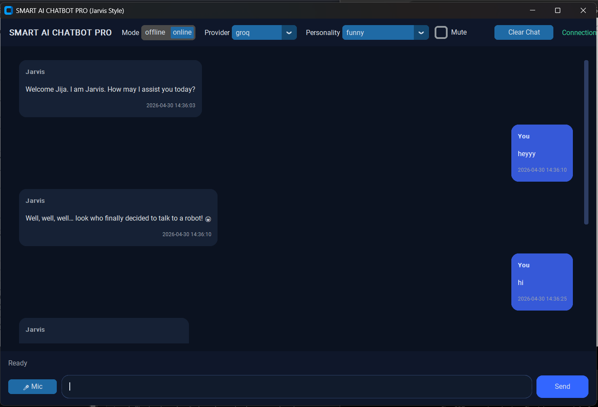
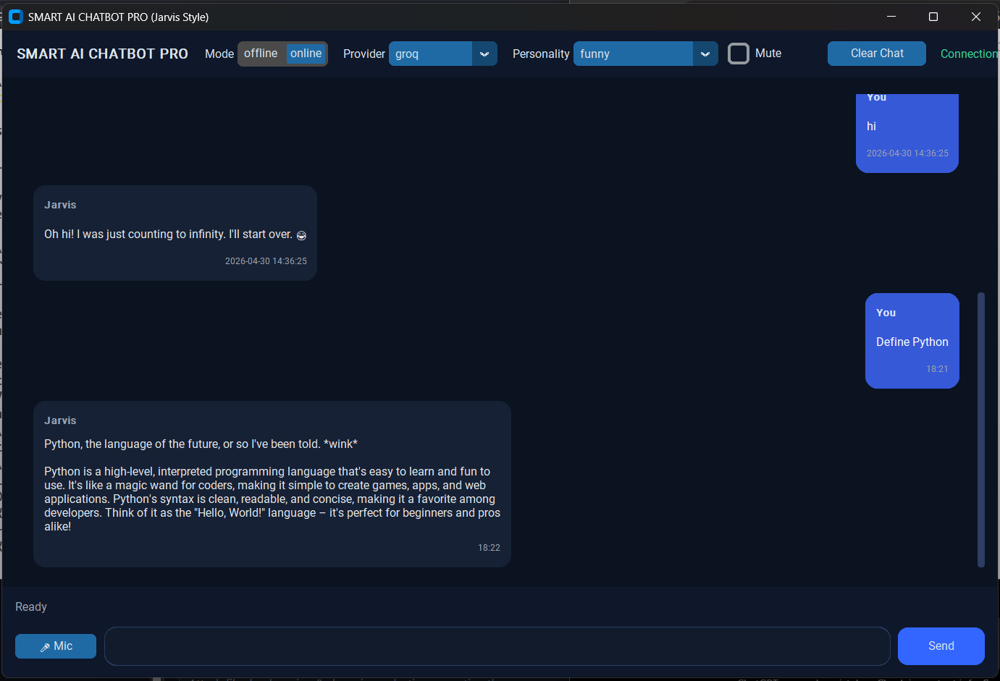
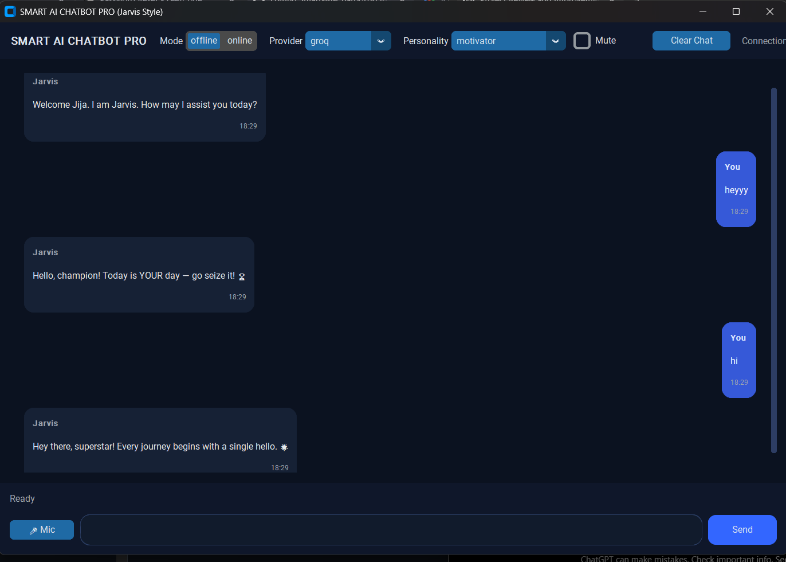

# 🤖 Smart AI Chatbot Pro (Jarvis Style)

> A modern Python desktop chatbot with personality, voice support, and both offline + online AI modes.

---

## ✨ Features

- 🎭 **Multiple Personalities**
  - Funny 😄
  - Motivator 💪
  - Angry 😤
  - Professional 💼

- 🧠 **Offline Smart Mode (Default)**
  - Works without internet
  - Intent-based responses
  - Mood + keyword detection

- 🌐 **Online AI Mode (Optional)**
  - Powered by Groq / OpenAI / Gemini
  - Automatic fallback to offline if unavailable

- 🖥️ **Modern Dark UI**
  - Chat bubbles
  - Smooth layout
  - Clean desktop experience

- 🎤 **Voice Support**
  - Text-to-speech
  - Speech-to-text (mic input)
  - Mute toggle

- 💾 **Memory System**
  - Remembers username
  - Stores favorite personality
  - Chat history tracking

- 🗄️ **SQLite Database**
  - User data
  - Chat history
  - Analytics (message count, last login)

---

## 📸 Screenshots
### 🏠 Home Screen

### 💬 Chat Example

### 🎭 Personality Mode with Offline feature

